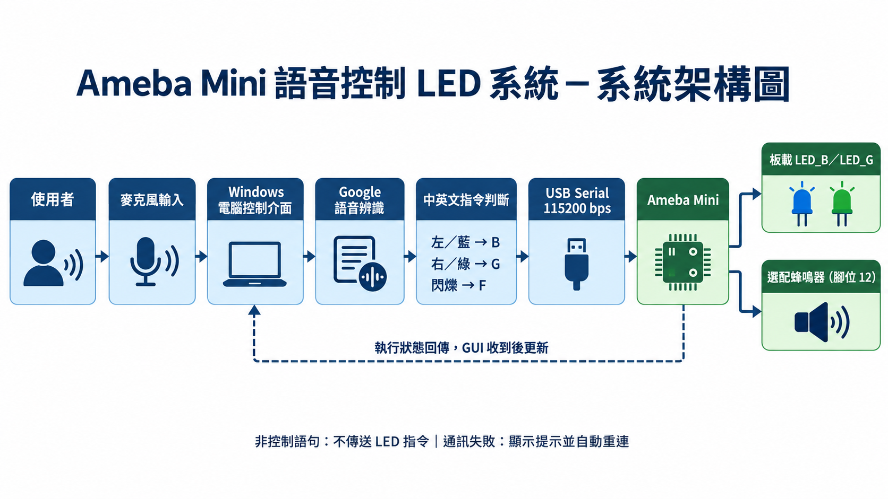

# Ameba Mini 語音控制 LED 系統

本專案運用生成式 AI 輔助開發（Vibe Coding），透過電腦麥克風辨識中英文語音指令，再使用 USB Serial 控制 Ameba Mini 板載藍色與綠色 LED。



## 專案功能

- 「左邊開燈」：開啟藍燈並關閉綠燈
- 「右邊開燈」：開啟綠燈並關閉藍燈
- 「閃爍三次」：藍燈與綠燈同步閃爍三次
- 支援繁體中文、英文及中英文自動辨識
- 顯示語音辨識結果、連線狀態與執行紀錄
- Ameba 執行後回傳狀態，GUI 收到回覆才更新 LED 顯示
- 支援 COM 埠自動偵測、連線測試及 USB 自動重連
- 非控制語句不會任意改變 LED 狀態
- 支援筆電語音回覆及選配蜂鳴器提示音

## 示範影片

YouTube：**【上傳影片後將此處換成實際連結】**

## 系統需求

### 硬體

- Ameba Mini 開發板（完整型號：**【請填寫】**）
- USB 資料傳輸線
- Windows 電腦及麥克風
- 選配：被動蜂鳴器或有驅動電路的小喇叭

### 軟體

- Arduino IDE
- 適用於實際板型的 Ameba Arduino Board Package
- Python 3
- 網際網路連線（Google 語音辨識需要）

## 安裝與執行

### 1. 燒錄 Ameba 韌體

1. 使用 Arduino IDE 開啟 `Ameba_LED_Control.ino`。
2. 選擇正確的 Ameba 板型及 COM 埠。
3. 編譯並上傳程式。
4. 上傳完成後關閉 Arduino Serial Monitor。

程式使用 `LED_B` 與 `LED_G` 控制板載 LED，目前控制邏輯為 `HIGH` 點亮、`LOW` 熄滅。不同板型請依官方 pin map 確認。

### 2. 安裝 Python 套件

安裝 Python 3 時請勾選 **Add Python to PATH**，接著雙擊 `install_packages.bat`，或在 PowerShell 執行：

```powershell
python -m pip install -r requirements.txt
```

### 3. 啟動程式

雙擊 `start.bat`。程式會自動搜尋 Ameba，介面顯示「已連線」後，先按「連線測試」，再啟動語音辨識。

## 通訊協定

| 指令 | 功能 | Ameba 回覆 |
|---|---|---|
| `B` | 開啟藍燈 | `Status: Blue LED ON` |
| `G` | 開啟綠燈 | `Status: Green LED ON` |
| `F` | 兩燈閃爍三次 | `Status: Flashed 3 times` |
| `Q` | 連線測試 | `PONG: connection is healthy` |
| `T1`～`T4` | 蜂鳴器提示音 | `Status: Ameba sound played` |

## 專案檔案

| 檔案 | 用途 |
|---|---|
| `voice_control.py` | 語音辨識、GUI 與序列通訊 |
| `Ameba_LED_Control.ino` | Ameba LED 及蜂鳴器控制程式 |
| `requirements.txt` | Python 套件清單 |
| `install_packages.bat` | Windows 套件安裝工具 |
| `start.bat` | Windows 啟動工具 |
| `system_architecture.png` | 系統架構圖 |
| `REPORT_CONTENT.md` | 報告文字草稿 |

## 異常處理

- 無法辨識或非控制語句：不傳送 LED 控制指令。
- Ameba 未連線：顯示錯誤，不更新為成功狀態。
- USB 中斷：顯示斷線並持續嘗試自動重連。
- 語音服務失敗：顯示服務錯誤，仍可使用快速測試按鈕。

## 作者

- 姓名：曾祥鎰
- 學號：61575042H
- 課程：物聯網

